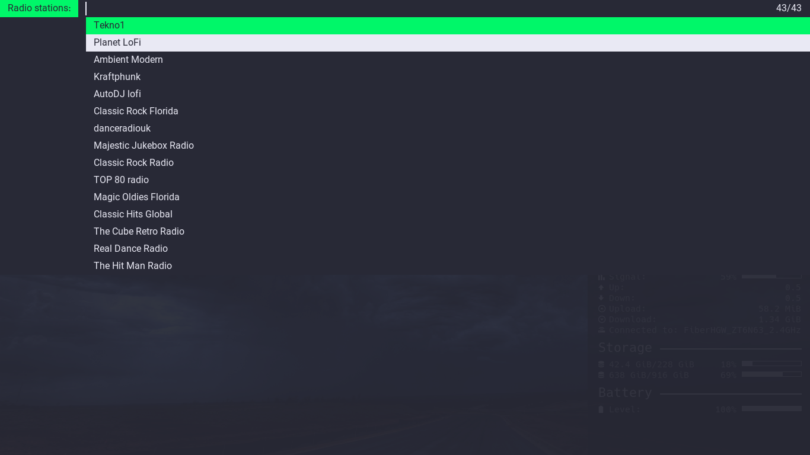
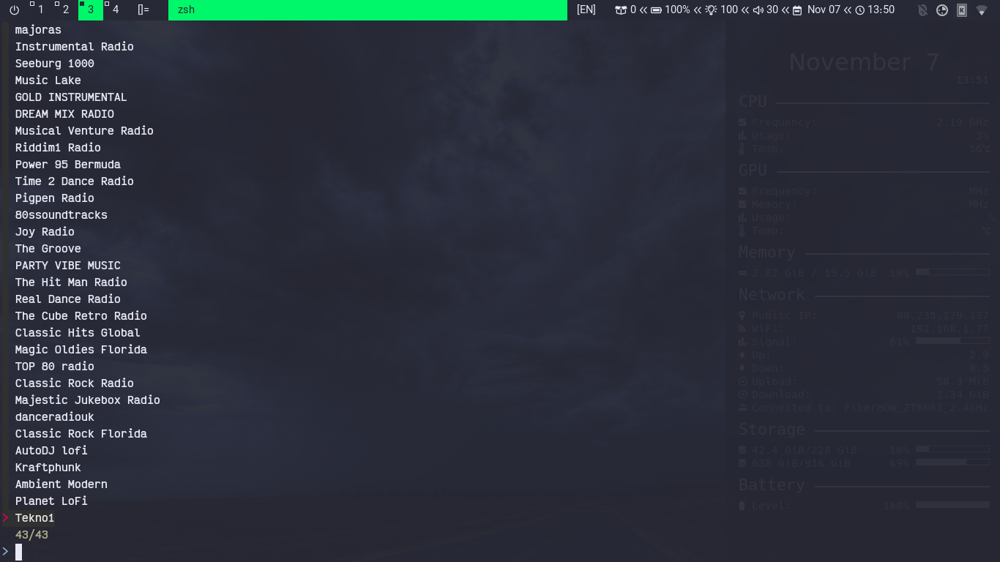
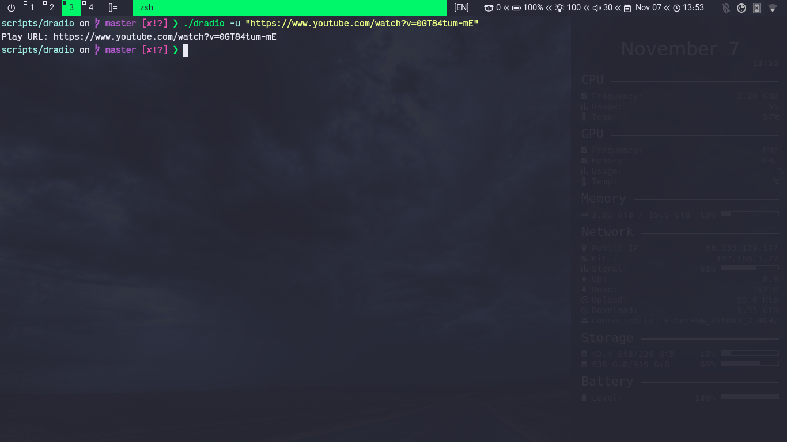
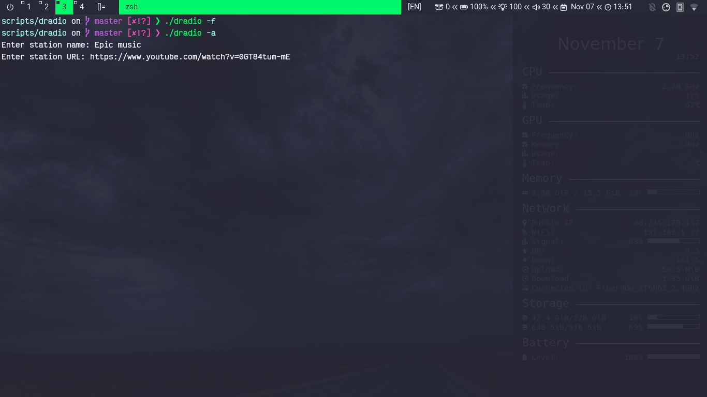
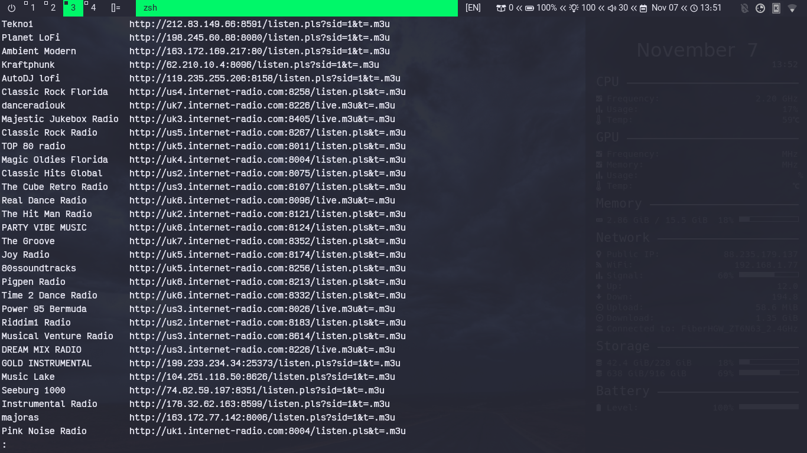

# dRadio
A simple script to play online radio stations in background. This script is used to stream online media sources like online radios stations or youtube videos using bash, and you can add, remove, or select your media source from the existing once. 

## Requirements
- [mpv](https://mpv.io/)
- [dmenu](https://tools.suckless.org/dmenu/)
- [fzf](https://github.com/junegunn/fzf)
- notify-send

## Installation
Place this script where you keep your scripts or run one of the following command:
```bash
# using curl
sudo curl -s https://raw.githubusercontent.com/mrbooshehri/scripts/master/dradio/dradio.sh > /usr/local/bin/dradio

# using wget
sudo wget -qcO /usr/local/bin https://raw.githubusercontent.com/mrbooshehri/scripts/master/dradio/dradio.sh
```
then make the script executable
```bash
chmod +x /usr/local/bin/dradio
```
**Note:** The stations file (```stations.txt```) is under ```~/.config/dradio```, you can manipulate it directly.

## Commands
```
  -l, --list		List of radio staions
  -d, --dmenu		Show stations list in dmenu
  -f, --fzf		Show stations list in fzf
  -s, --stop		Stop mpv player
  -S, --status		Show the now playing station info
  -a, --add 		Add staion
  -r, --remove		Remove station
  -u, --url		Play input URL
  -h, --help		Show help
  -v, --version		Show version
```

## Usage
* Play from existing stations
	* dmenu: ```dradio -d```
 
		 
 
	* fzf: ```dradio -f```
		
		 
		
* Play from URL: ```dradio -u "URL"```
	
	 

* Stop player: ```dradio -s```
 
* Show the now playing station info: ```dradio -S```
	
* Add station:```dradio -a```

	 
	
* Remove station: ```dradio -r```

	 

* List all stations: ```dradio -l```

	 
	
## Contributing
Pull requests are welcome, just fork the project made your changes and submit your request.
