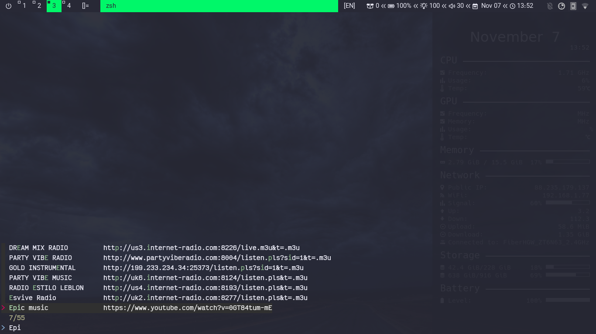

# dRadio
A simple script to play online radio stations in background. This script is used to stream online media sources like online radios stations or youtube videos using bash, and you can add, remove, or select your media source from the existing once. 

## Requirements
- [mpv](https://mpv.io/)
- [dmenu](https://tools.suckless.org/dmenu/)
- [fzf](https://github.com/junegunn/fzf)
- notify-send

## Installation
Place this script where you keep your scripts or run one of the following command:
```bash
# using curl
sudo curl -s https://raw.githubusercontent.com/mrbooshehri/scripts/master/dradio/dradio.sh > /usr/local/bin/dradio

# using wget
sudo wget -qcO /usr/local/bin https://raw.githubusercontent.com/mrbooshehri/scripts/master/dradio/dradio.sh
```
then make the script executable
```bash
chmod +x /usr/local/bin/dradio
```
**Note:** The stations file (```stations.txt```) is under ```~/.config/dradio```, you can manipulate it directly.

## Usage
* Play from existing stations
	* dmenu: ```dradio -d```
		 
		 
	* 
	* fzf: ```dradio -f```
		
		 
		
* Play from URL: ```dradio -u "URL"```
	
	 

* Stop player: ```dradio -s```
	
* Add station:```dradio -a```

	 
	
* Remove station: ```dradio -r```

	 

* List all stations: ```dradio -l```

	 
	
## Contributing
Pull requests are welcome. For major changes, please open an issue first to discuss what you would like to change.
